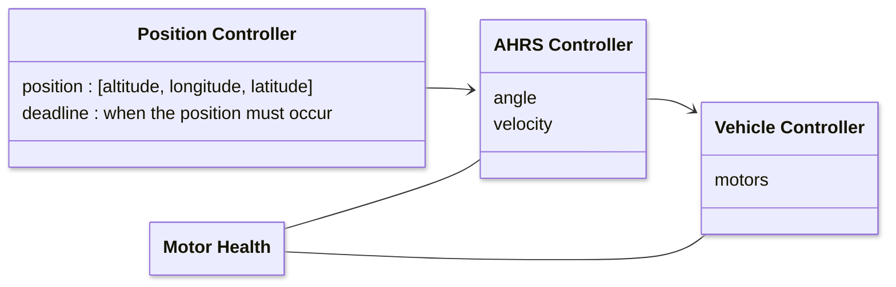

Concept of Operation
================================================================================

## Flight Controller
For autonomous display missions, the flight controller's objective is to achieve
the position objective by the deadline. The flight controller is unaware of it's
surroundings.

[Collision Avoidance](#collision-avoidance) is managed separately at a higher context.
To avoid collisions, new paths are created by directing the flight controller to
subpath position waypoints.

Architecture inspired by [PX4](https://docs.px4.io/main/en/concept/architecture.html).

The flight controller is responsible for managing manuevers from the current
position to the objective position. Manuevers are dynamic - constantly
adjusting to their environment (wind, precipitation, motor health, etc).

* Position Controller - dictates the objective location and deadline

* AHRS Controller - dynamically controls the physical manuever toward objective

* Vehicle Controller - actuates the manuever

* Motor Health - raises awareness of motor performance
    * Vehicle Controller
        * may use to raise/lower commanded rate of motors
    * AHRS Controller
        * may use to rotate it's orientation to optimize the manuever

## Collision Avoidance
For safety and mission, drones must avoid collisions.

Spacial partitions include:
* static - buildings, utility wiring, etc.
* dynamic
    * aircraft
    * drones of the same swarm