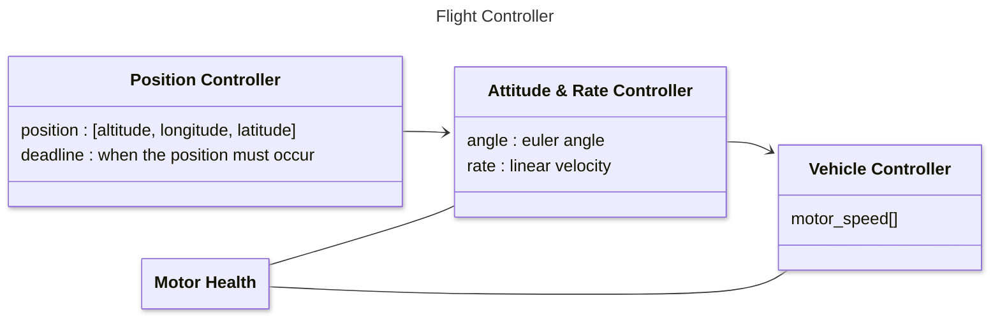

Rust Autonomous Drone Architecture
================================================================================

## Flight Controller
For autonomous display missions, the flight controller's objective is to achieve
the position objective by the deadline. The flight controller is unaware of it's
surroundings.

[Object Avoidance](#object-avoidance) is managed separately at a higher context.
To avoid collisions, new paths are created by directing the flight controller to
subpath position objectives.

<!-- ```mermaid
architecture-beta
    group fc(server)[Flight Controller]
        service pc(server)[Position Controller] in fc
        %% service arc(server)[Attitude & Rate Controller] in fc
        service arc(server)[Attitude Rate Controller] in fc
        service control(server)[Vehicle Controller] in fc
        service health(database)[Motor Health] in fc

    pc:R -- L:arc
    arc:R -- L:control
    control:B -- T:motors
    control:R -- L:health
    health:T -- T:arc

    group hardware(server)[Hardware]
        service motors(server)[Motors] in hardware
        service gps(server)[GPS] in hardware
        service imu(server)[IMU] in hardware

    gps:T -- B:pc
    imu:T -- B:arc
``` -->


The flight controller is responsible for managing manuevers from the current
position to the objective position. Manuevers are dynamic - constantly
adjusting to their environment (wind, precipitation, motor health, etc).

* Position Controller - creates manuevers
    * Uses the linear path from the current position to the objective position
    * velocity along the path controlled by the deadline

* Attitude & Rate Controller - dynamically controls the manuever
    * Chooses the vehicle attitude and desired velocity for the manuever

* Vehicle Controller - manages the motor actuation toward the maneuver

* Motor Health - raises awareness of motor performance
    * Vehicle Controller
        * may use to raise/lower commanded rate of motors
    * Attitude & Rate Controller
        * may use to rotate it's orientation to optimize the manuever


## Object Avoidance
To safely use drones, they must stay within allowed space partitions.

Spacial partitions include:
* static - buildings, utility wiring, etc.
* dynamic
    * aircraft
    * drones of the same swarm